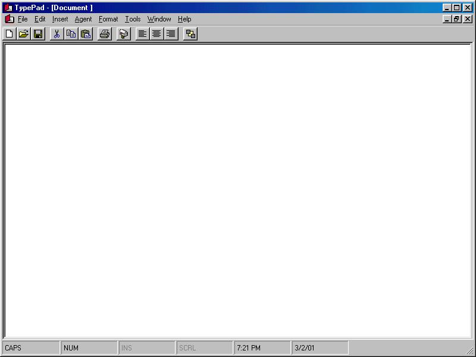



## TypePad

### Description

Please leave comments. It helps me understand what people want or expect from a program like this. This is quite an advanced word processor. You can manipulate files, use the clipboard, print, print preview, setup page margins.

You can also send documents as attachments through the email system, but you need the control, which is free, from Axsoft. Also,

Microsoft Agent needs to be installed on your

system. I have included the character here.

Install it to c:\windows\msagent\chars folder.

Once done, enjoy TypePad.

If you have VCI VisualSpeller, you can also

use this application to spell check. This

program also can insert pictures from files,

files, plus text files. To have the spell checker, a Borland product must be on your computer. Thank you for your interest.
 
### More Info
 
You need some Active X controls from AxSoft and the VCI VisualSpeller for spell checking to work.

             |
---                |---
**Submitted On**   |2001-03-02 19:18:32
**By**             |[Robin Thomas Benjamin McKay](https://github.com/Planet-Source-Code/PSCIndex/blob/master/ByAuthor/robin-thomas-benjamin-mckay.md)
**Level**          |Intermediate
**User Rating**    |3.8 (15 globes from 4 users)
**Compatibility**  |VB 5\.0, VB 6\.0
**Category**       |[String Manipulation](https://github.com/Planet-Source-Code/PSCIndex/blob/master/ByCategory/string-manipulation__1-5.md)
**World**          |[Visual Basic](https://github.com/Planet-Source-Code/PSCIndex/blob/master/ByWorld/visual-basic.md)
**Archive File**   |[CODE\_UPLOAD15723322001\.zip](https://github.com/Planet-Source-Code/robin-thomas-benjamin-mckay-typepad__1-21461/archive/master.zip)

